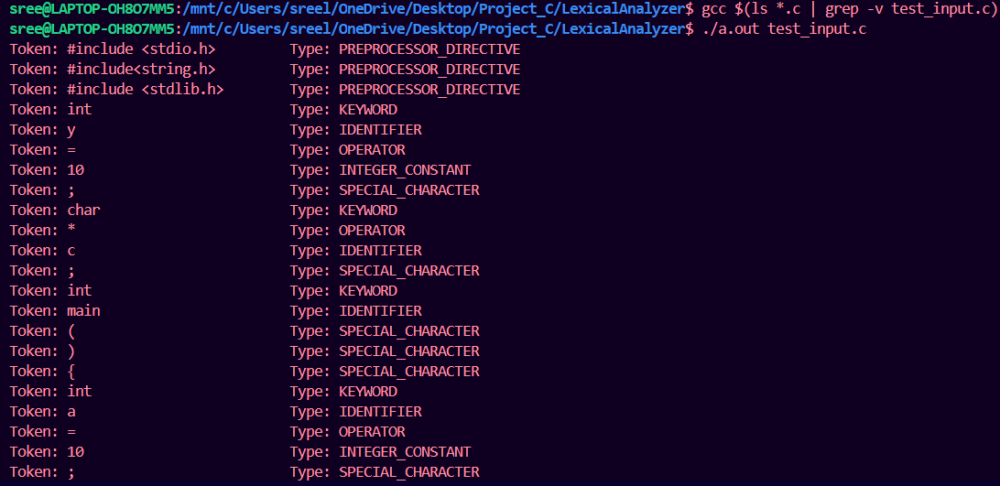

# 🧠 Lexical Analyzer in C

A command-line tool in C to **scan and classify tokens** from C source code files — simulating the front-end phase of a compiler using low-level file operations.

---

## Table of Contents

- [Features](#features)
- [Prerequisites](#prerequisites)
- [Building](#building)
- [Usage](#usage)
  - [Run Analyzer](#run-analyzer)
 
- [How It Works](#how-it-works)
  - [Tokenization Logic](#tokenization-logic)
- [Project Structure](#project-structure)
- [Error Handling](#error-handling)
- [Output](#output)


---

## Features

- 🔍 Scans C source code to identify tokens  
- 🔑 Detects keywords, identifiers, constants, operators, special symbols, and literals  
- 🧠 Implements FSM-style scanning and pattern matching  
- ✨ Command-line usage for batch analysis  
- 🔧 Modular source files for lexer, error handling, and token definitions  

---

## Prerequisites

- GCC or any C compiler  
- Basic terminal usage  
- A valid `.c` file with test code  

---

## Building

```bash
gcc $(ls *.c | grep -v test_input.c) 
```

---

## Usage

### Run Analyzer

```bash
./a.out test_input.c
```


---

## How It Works

### Tokenization Logic

- Reads each character of the file  
- Groups characters into valid tokens  
- Classifies each token into categories:
  - Keywords (e.g., `int`, `return`)
  - Identifiers (e.g., `main`, `sum`)
  - Constants (e.g., `123`, `3.14`)
  - Operators (e.g., `+`, `=`)
  - Special Symbols (e.g., `(`, `{`, `;`)
  - String & Character Literals (`"hello"`, `'a'`)  
- Reports unrecognized sequences via the error module  

---

## Project Structure

```
.
├── main.c             # Entry point and file reader
├── lexer.c / lexer.h  # Lexical scanning and classification logic
├── error.c / error.h  # Error reporting
├── types.h            # Token type definitions
├── test_input.c       # Sample C file to analyze
├── a.out              # Compiled binary (optional)
```

---

## Error Handling

- ❌ File open/read errors  
- ❌ Unterminated strings or characters  
- ❌ Unexpected characters  
- ✅ Reports errors clearly via `error.c`

---

## Output





---

